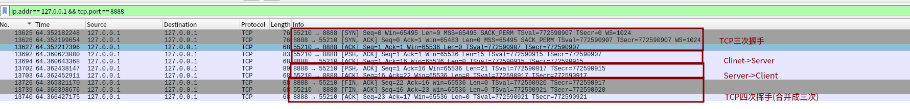

# 1. Start 开始  
 
## 目标  
1. 实现一个简单的TCP客户端和服务器
2. 利用Wireshark分析TCP握手、数据传输、关闭连接等过程

## 代码实现
1. [SimpleServer.java](../src/main/java/org/lwx/learnTCP/Simple/SimpleServer.java)
2. [SimpleClient.java](../src/main/java/org/lwx/learnTCP/Simple/SimpleClient.java)

## Wireshark抓包
1. 安装并启动Wireshark
2. 配置Wireshark权限
   - https://wiki.wireshark.org/CaptureSetup/CapturePrivileges#gnulinux-distributions-wireshark-is-installed-using-a-package-manager
3. 启动Wireshark，选择要监听的网络接口（如eth0）并过滤TCP流量
   - `ip.addr == 127.0.0.1 && tcp.port == 8888`
4. 运行SimpleServer.java和SimpleClient.java
5. 在Wireshark中查看TCP握手、数据传输、关闭连接等过程
   - 分析TCP的SYN、ACK、FIN、RST等标志位
   - 查看数据 payload 是否正确
   - [Wireshark抓包文件](Captures/SimpleTCP.pcapng)

